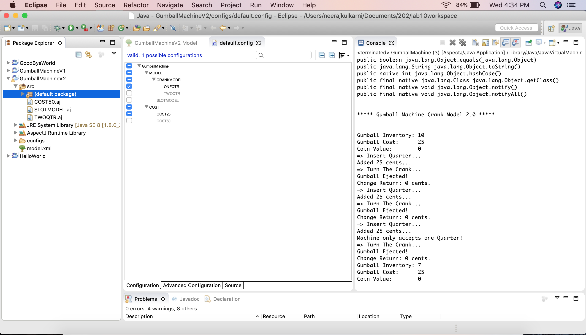
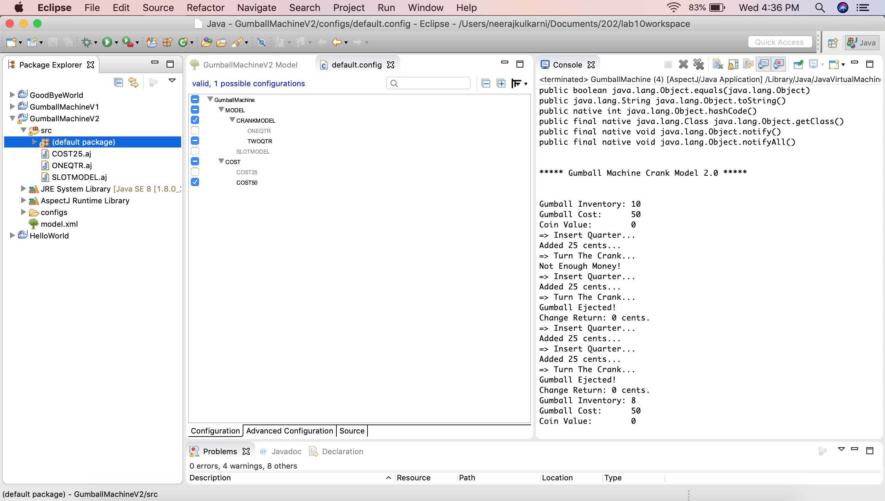
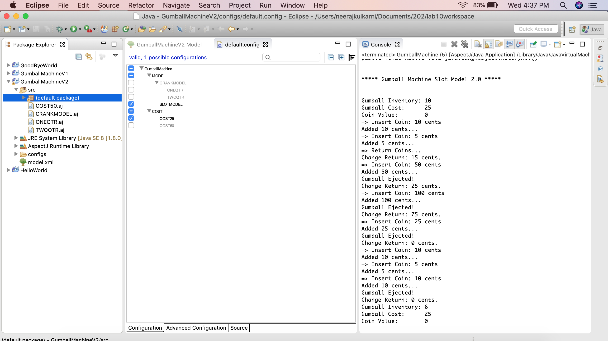
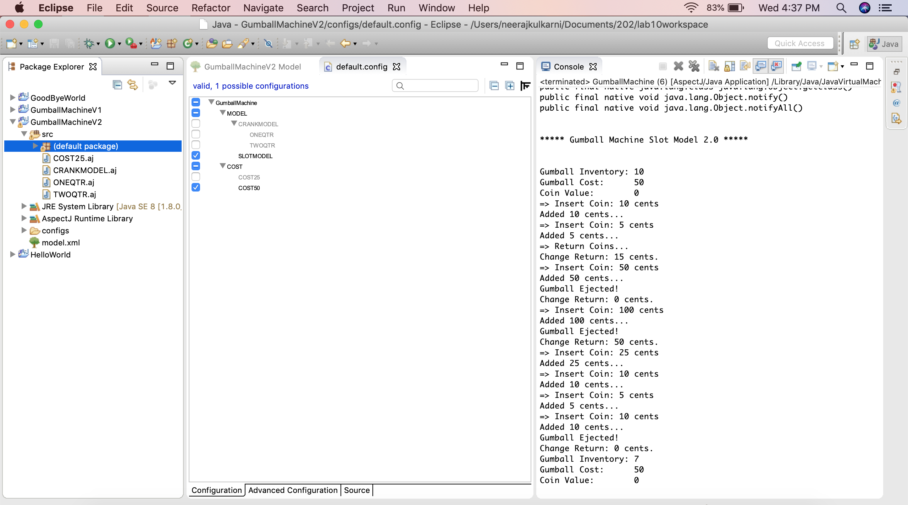

# Comparison between LAB 1 - Code Maintainability and Feature IDE / AspectJ solution

- Feature IDE/Aspect code for Gumball machine is highly modularized as compared to the lab 1 solution. Therefore it also proves easier to maintain and manage.

- Compared to the lab 1 solution, the Feature IDE/Aspect code is easier to debug.

- Behaviour of the Feature IDE/Aspect code can be easily changed during runtime.

# Screenshots

## Screenshot for Crank Model, with cost of one gumball = 25 cents

## Screenshot for Crank Model, with cost of one gumball = 50 cents

## Screenshot for Slot Model, with cost of one gumball = 25 cents

## Screenshot for Slot Model, with cost of one gumball = 50 cents

